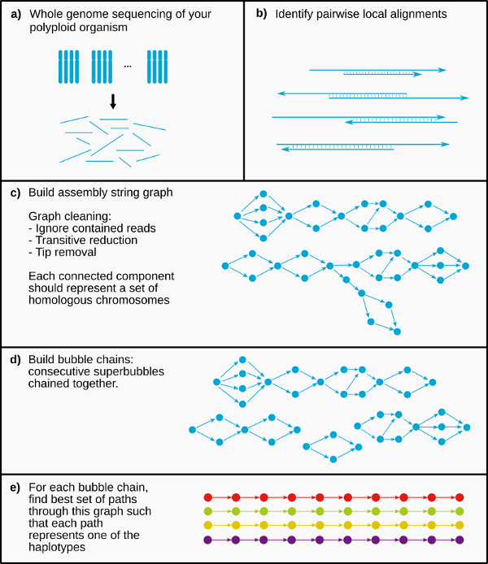

PHASM: Haplotype-aware *de novo* genome assembly for polyploid organisms
========================================================================

PHASM is a long read *de novo* genome assembler that phases variants among 
chromosome homologues during the assembly process, and aims to output separate 
contigs for each haplotype. The main idea in PHASM is to build bubble chains: 
consecutive "superbubbles" chained together. While most traditional genome 
assemblers pop these superbubbles by only keeping the best supported path, 
PHASM finds *k* paths through this chain of superbubbles that best represent 
each haplotype.

This program has been created as part of my master thesis project. For now, it 
has only been tested with error free data.

Requirements
------------

* Python >= 3.5
* NumPy >= 1.11
* SciPy >= 0.16
* NetworkX >= 1.9, NetworkX >= 2.0 not supported
* dinopy >= 2.0
* pybind11 >= 1.7
* (tests) pytest
* A C++ compiler that supports the C++14 standard

Installation
------------

PHASM is not on PyPI yet, so for now you'll have to clone this repository and 
run:

    pip install -r requirements.txt
    python setup.py install

Related Repositories
--------------------

* [aneusim][aneusim]: a tool to generate synthetic aneuploid/polyploid genomes
* [phasm-benchmarks][phasm-benchmarks]: a complete [snakemake][snakemake] 
  pipeline that starts with finding pairwise local alignments between reads 
  using DALIGNER, and ends with an assembled polyploid genome.

[aneusim]: https://github.com/AbeelLab/aneusim
[phasm-benchmarks]: https://github.com/AbeelLab/phasm-benchmarks
[snakemake]: https://bitbucket.org/snakemake/snakemake

Documentation
=============

Overview
--------

The PHASM pipeline consists of four main stages:

1. Overlapper
2. Assembly graph construction
3. Bubblechain identification
4. Phasing

Files
-----

PHASM uses 3 main "file types":

* Reads FASTA file
* Pairwise overlap GFA2 file
    * This file contains all pairwise overlaps between reads. Individual reads 
      are denoted as segments, the overlaps as edges. Note that this file does 
      not contain an assembly graph, it merely contains pairwise overlaps.
* Assembly graph GFA2 file
    * A file of this type contains an assembly graph. Although this is also a 
      GFA2 file, it contains different data than the previous file type. In 
      this file segments are nodes in the assembly graph, and edges are indeed 
      edges in the assembly graph.
    * Nodes in the assembly graph do not necessarily correspond to a single 
      read. If a node is built from multiple reads, then the involved reads 
      will be denoted on fragment lines.
    * PHASM uses this file type for both the complete assembly graph and each 
      individual bubble chain.

### External Links

* [GFA2 spec][gfa2-spec]

[gfa2-spec]: https://github.com/GFA-spec/GFA-spec/blob/master/GFA2.md

Logging Output
--------------

PHASM logs messages describing its current state to standard error. Its 
verboseness can be controlled using the `-v` switch, and this works for any of 
the commands described below. PHASM has three verboseness levels. Please note 
that the `-v` switch needs to be set before any of the subcommands.

Examples:

    phasm overlap ...  # No logging
    phasm -v layout ...  # Verboseness level 1
    phasm -vv layout ..  # Verboseness level 2

`phasm overlap` - Overlapper
----------------------------

    usage: phasm overlap [-h] [-l MIN_LENGTH] [-o OUTPUT] fasta_input

    positional arguments:
      fasta_input           The fasta file with reads.

    optional arguments:
      -h, --help            show this help message and exit
      -l MIN_LENGTH, --min-length MIN_LENGTH
                            The minimum overlap length between two reads (default:
                            1000).
      -o OUTPUT, --output OUTPUT
                            The output file. Defaults to standard output.

This command finds pairwise overlaps between reads in the given FASTA file. You 
can specify a minimum length for each overlap. The output is a pairwise overlap 
GFA2 file.

`phasm layout` - Assembly graph construction
--------------------------------------------

    usage: phasm layout [-h] [-l LENGTH] [-s LENGTH] [-a LENGTH] [-r FRACTION]
                        [-t NUM] [-T MAX_TIP_LENGTH_BASES] [-F LENGTH] [-g {1,2}]
                        [-o FILE] [-M JSON_FILE]
                        gfa_file

    optional arguments:
      -h, --help            show this help message and exit

    Alignment and read filtering:
      -l LENGTH, --min-read-length LENGTH
                            Filter reads smaller than the given length (default:
                            disabled)
      -s LENGTH, --min-overlap-length LENGTH
                            Minimum length of the overlap between two reads,
                            otherwise this alignment is ignored. Default is
                            disabled, because it's something that's usually
                            handled by your overlapper.
      -a LENGTH, --max-overhang-abs LENGTH
                            Max absolute overhang length (default: 1000).
      -r FRACTION, --max-overhang-rel FRACTION
                            Max overhang length as fraction of the overlap length
                            (default: 0.8).

    Graph cleaning:
      -t NUM, --max-tip-length NUM
                            Maximum number of edges of a path to be called a tip
                            (default: 4).
      -T MAX_TIP_LENGTH_BASES, --max-tip-length-bases MAX_TIP_LENGTH_BASES
                            The maximum length (in bases instead of edges) of a
                            tip (default 5000).
      -F LENGTH, --length-fuzz LENGTH
                            Transitive reduction length fuzz parameter (default:
                            1000). See Myers (2005).

    Input/output:
      -g {1,2}, --gfa-version {1,2}
                            Which GFA version to use when writing a graph to a GFA
                            file (default GFA2).
      -o FILE, --output FILE
                            Output file (default stdout). If a filename is given,
                            it checks the file extension for output type.
                            Supported file extensions are 'graphml' and 'gfa'.
                            This option can be used multiple times to write
                            multiple files.
      -M JSON_FILE, --metadata JSON_FILE
                            Output a bit of debug data to the given JSON file.
                            Optional. This will increase memory usage when
                            enabled.
      gfa_file              Input GFA2 file with all pairwise local alignments.

This commands creates the complete assembly graph from your pairwise overlaps. 
The only input file is the GFA2 file created with `phasm overlap`. The assembly 
graph construction is very similar to `miniasm`, so for more in depth 
explanation of above parameters please read that paper.

This command can generate multiple output files. By specifying `-o` multiple 
times on the command line, it will generate multiple files. It will check the 
file extension to determine what kind of file to write. PHASM can write GraphML 
files (useful for visualising in Cytoscape) and GFA(2) files. It is not 
possible to write both GFA1 and GFA2 at the same time.

### External Links

* [miniasm][miniasm]

[miniasm]: https://academic.oup.com/bioinformatics/article/32/14/2103/1742895/Minimap-and-miniasm-fast-mapping-and-de-novo

`phasm chain` - Identify bubble chains
--------------------------------------

    usage: phasm chain [-h] [-l MIN_LENGTH] [-f FORMAT] [-o OUTPUT_DIR] 
    graph_gfa

    positional arguments:
      graph_gfa             The assembly graph in GFA2 format. Other graph formats
                            are not supported. Note that this is a different file
                            than the GFA2 file with pairwise local alignments.

    optional arguments:
      -h, --help            show this help message and exit
      -l MIN_LENGTH, --min-length MIN_LENGTH
                            Some paths in the assembly graph are not part of a
                            bubble chain, PHASM will not try to phase these paths
                            but outputs them as 'normal' contigs. With this flag
                            you can specify the minimum length of a contig to be
                            included (default: 5000).
      -f FORMAT, --format FORMAT
                            Comma separated list of output formats. Supported:
                            gfa1, gfa2, graphml (default: only GFA2). If multiple
                            formats given, each bubble chain will get a file in
                            each specified format. This allows you for example to
                            both write GFA2 and GraphML files at the same time.
      -o OUTPUT_DIR, --output-dir OUTPUT_DIR
                            Output directory. If the directory does not exist, it
                            will be created. All identified bubble chains will be
                            written to a separate file in this directory.

This command identifies bubble chains in the given assembly graph. Each bubble 
chain (which is a subgraph of the original assembly graph), will be written to 
its own GFA2 file. By default it only outputs GFA2 files, but it is possible to 
write files in GraphML too using the `-f` switch.

Besides bubble chains, this command also identifies unambiguous linear paths in 
the assembly graph not part of a bubble chain and outputs these as "normal 
contigs". The minimum length of such path can be specified using `-l`.

`phasm phase` - Bubble chain phasing
------------------------------------

    usage: phasm phase [-h] -p PLOIDY [-s MIN_SPANNING_READS] [-b 
    MAX_BUBBLE_SIZE]
                       [-t THRESHOLD] [-d PRUNE_FACTOR] [-c MAX_CANDIDATES]
                       [-r MAX_PRUNE_ROUNDS] [-S PRUNE_STEP_SIZE] [-D DEBUG_DATA]
                       [-o OUTPUT]
                       reads_fasta alignments_gfa subgraphs [subgraphs ...]

    positional arguments:
      reads_fasta           The FASTA file with all your reads. A FASTA index file
                            should be present.
      alignments_gfa        The GFA2 file with all pairwise local alignments (used
                            to create the initial assembly graph). This is a
                            different file than your bubblechain GFA2 file.
      subgraphs             The bubblechain/contig graph GFA2 file(s). If given
                            multiple files, these files will be processed
                            sequentially, but the DNA sequences will be written to
                            the same file.

    optional arguments:
      -h, --help            show this help message and exit
      -p PLOIDY, --ploidy PLOIDY
                            The ploidy level.
      -s MIN_SPANNING_READS, --min-spanning-reads MIN_SPANNING_READS
                            If there re less spanning reads between two bubbles
                            than the given number then PHASM will start a new
                            haploblock.
      -b MAX_BUBBLE_SIZE, --max-bubble-size MAX_BUBBLE_SIZE
                            The maximum number of simple paths through a bubble.
                            If a bubble contains more paths from its entrance to
                            exit than the given number, it is considered too big,
                            and a new haploblock will be created. The bubble
                            itself will be phased on its own and not in
                            conjunction with other bubbles. Especially for larger
                            ploidies you may want to lower this number a bit, as
                            the number of k-tuples is p^k, where p is the number
                            of paths. Default value is 10.
      -t THRESHOLD, --threshold THRESHOLD
                            The minimum relative likelihood of a candidate
                            haplotype set to be considered for any following
                            bubbles (default: 1e-3).
      -d PRUNE_FACTOR, --prune-factor PRUNE_FACTOR
                            Any candidate haplotype set with a relative likelihood
                            lower than the given prune factor times the top
                            scoring candidate will be pruned (default: 0.1).
      -c MAX_CANDIDATES, --max-candidates MAX_CANDIDATES
                            At each bubble, limit the number of candidate
                            haplotype sets. If there more candidates than the
                            given number even after an initial pruning step, we
                            increasingly prune more stringest another time, until
                            the number of candidates falls below the given number
                            (default 500). The maximum number of pruning rounds
                            can be specified with the option '-r'.
      -r MAX_PRUNE_ROUNDS, --max-prune-rounds MAX_PRUNE_ROUNDS
                            Maximum number of pruning rounds if the number of
                            candidate haplotype sets is to high (default: 9).
      -S PRUNE_STEP_SIZE, --prune-step-size PRUNE_STEP_SIZE
                            With each pruning round, increase the prune factor
                            with the given number (default: 0.1).
      -D DEBUG_DATA, --debug-data DEBUG_DATA
                            Output another file containing loads of debug data
                            produced during the phasing process (optional).
      -o OUTPUT, --output OUTPUT
                            Output file (default: stdout).

This command performs the actual phasing. It requires three input files: the 
FASTA file with reads, the pairwise overlaps file (created using `phasm 
overlap`), and the bubble chain GFA2 file. The reads FASTA file should have an 
accompanying index file (created using `samtools faidx`).

My [master thesis][master-thesis] describes the phasing algorithm in more 
detail.

[master-thesis]: https://github.com/AbeelLab/phasm/raw/master/docs/master-thesis.pdf
